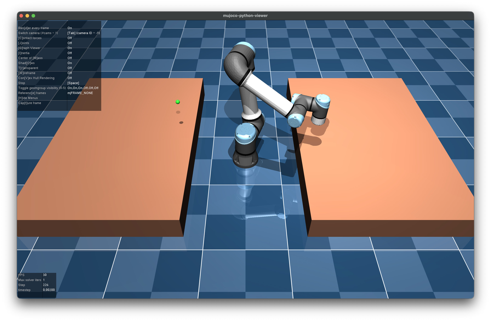
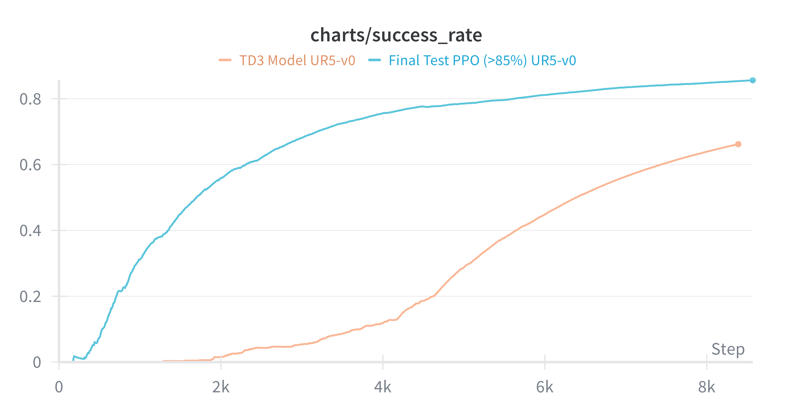

# UR5 Robotic Arm Control via Deep Reinforcement Learning

<p align="center">
  
  
  
  
  
</p>

**Training a 6-DOF robotic manipulator to autonomously reach randomized target positions using PPO and TD3 — from scratch, in simulation.**

This project implements, tunes, and benchmarks two state-of-the-art deep reinforcement learning algorithms for continuous robotic control: **Proximal Policy Optimization (PPO)** and **Twin Delayed DDPG (TD3)**. The entire pipeline — environment, reward function, training loop, and evaluation — was built and iterated on as a research project in intelligent robotics.

---

## Simulation Environment

<p align="center">
  
</p>

> _The UR5e arm in the MuJoCo physics simulator. The green sphere marks the target position the agent must learn to reach. Two work surfaces simulate a realistic tabletop manipulation scenario._

---

## Demo
[Watch Demo Video!](https://github.com/niccolasparra/UR5-Reinforcement-Learning/issues/1#issue-4107960304)
   


> _A trained agent controlling the UR5 arm to reach a target pose in real time._

---

## Why This Project Matters

Most RL tutorials stop at CartPole or Atari. This project tackles a **real robotics problem**: controlling a physical-grade 6-DOF manipulator in a physics-accurate simulator with joint limits, gravity, collisions, and a shaped reward signal that had to be carefully engineered.

The core challenge: **How do you get a neural network to learn smooth, collision-free trajectories to arbitrary 3D positions — using only trial and error?**

---

## Technical Architecture

### The Environment (`env.py`)

A custom **Gymnasium environment** built on top of MuJoCo that simulates the UR5e robotic arm with full rigid-body dynamics.

| Component | Details |
|---|---|
| **Observation Space** | 19D vector: joint positions (6) + joint velocities (6) + end-effector position (3) + goal position (3) + collision flag (1) |
| **Action Space** | 6D continuous: per-joint velocity deltas, bounded at ±0.05 rad/step |
| **Physics** | MuJoCo with 10 substeps per action, PD position controller with gravity compensation (Kp=2000, Kd=400) |
| **Episode** | Max 1024 steps. Terminates on success (EE within 5cm of goal) or collision |
| **Goal Sampling** | Randomized target positions within the robot's reachable workspace at each episode reset |

### Reward Function Design

The reward function is the single most critical design decision in any RL system. This one was engineered through multiple iterations to balance **learning speed**, **trajectory smoothness**, and **collision avoidance**:

```
R(s, a, s') = progress + distance_penalty + orientation + collision + success + time_penalty
```

| Component | Formula | Purpose |
|---|---|---|
| **Progress** | `10.0 × (d_prev - d) / max(d, 1e-6)` | Rewards getting closer to the goal |
| **Distance Penalty** | `-0.5 × d` | Continuous pressure to minimize distance |
| **Collision** | `-10.0` on contact | Hard penalty for unsafe trajectories |
| **Success Bonus** | `+100.0` when `d < 0.05m` | Clear terminal reward signal |
| **Time** | `-0.01` per step | Encourages efficiency |
| **Orientation** | `w × (alignment)^2` | Optional alignment of EE axis with target |

**Key design insight:** normalizing the progress reward by `max(d, 1e-6)` creates a relative improvement signal — the agent gets proportionally more reward for small improvements when it's already close to the goal, producing better fine-grained positioning behavior.

### Algorithms

#### PPO (Proximal Policy Optimization) — On-Policy

An actor-critic architecture with a clipped surrogate objective that constrains policy updates to prevent catastrophic forgetting.

- **Actor**: 2-layer MLP (64 units, Tanh activations) with learned log-std for stochastic Gaussian policy
- **Critic**: Separate 2-layer MLP (64 units) estimating state value V(s)
- **Key hyperparameters**: `clip_coef=0.2`, `ent_coef=0.01`, `gae_lambda=0.95`, `num_steps=1024`, `update_epochs=10`
- **Orthogonal initialization** on all layers for stable early training

#### TD3 (Twin Delayed DDPG) — Off-Policy

A deterministic actor-critic with three stabilization mechanisms that address Q-value overestimation in continuous control.

- **Actor**: 2-layer MLP (256 units, ReLU) outputting deterministic actions via Tanh
- **Twin Critics**: Two independent Q-networks — the minimum of both is used for target computation, reducing overestimation bias
- **Delayed Policy Updates**: Actor updates every 2 critic updates, preventing policy oscillation on noisy value estimates
- **Target Policy Smoothing**: Clipped Gaussian noise added to target actions, smoothing the value landscape
- **Key hyperparameters**: `buffer_size=1M`, `batch_size=256`, `tau=0.005`, `exploration_noise=0.1`, `policy_noise=0.2`

### Inverse Kinematics Module (`ik.py`, `ik_solver.py`)

A custom IK solver used to **initialize the robot near the start position** at episode reset, improving sample efficiency by reducing the initial distance the agent needs to learn to traverse.

---

## Repository Structure

```
├── env.py                         # Custom Gymnasium environment (UR5 + MuJoCo)
├── __init__.py                    # Gym environment registration (UR5-v0)
├── ik.py                          # Inverse kinematics implementation
├── ik_solver.py                   # IK solver utilities
│
├── Algorithms/
│   ├── ppo_continuous_action.py   # PPO implementation (adapted from CleanRL)
│   └── td3_ur5.py                 # TD3 implementation (adapted for UR5)
│
├── Scripts/
│   ├── visualize_agent.py         # Visualize trained agent behavior
│   └── record_hd.py              # Record high-quality evaluation videos
│
├── assets/                        # UR5e MuJoCo model (MJCF + OBJ meshes)
│   ├── scene.xml                  # World scene definition
│   ├── ur5e.xml                   # UR5e robot model
│   └── assets/                    # 3D mesh files (.obj)
│
├── requirements.txt               # Python dependencies
└── LICENSE
```

---

## Getting Started

### Prerequisites

- Python 3.10+
- A machine with a GPU is recommended for training (CPU works but is slower)
- GLFW for MuJoCo rendering on macOS: `brew install glfw`

### Installation

```bash
git clone https://github.com/niccolasparra/UR5-Reinforcement-Learning.git
cd UR5-Reinforcement-Learning

# Create and activate a virtual environment (recommended)
python -m venv venv
source venv/bin/activate

# Install dependencies
pip install -r requirements.txt
```

### Training

**Train PPO:**
```bash
python Algorithms/ppo_continuous_action.py \
    --total-timesteps 1000000 \
    --num-envs 1 \
    --learning-rate 3e-4 \
    --track
```

**Train TD3:**
```bash
python Algorithms/td3_ur5.py \
    --total-timesteps 500000 \
    --learning-rate 3e-4 \
    --track
```

Training metrics (episodic return, success rate, losses) are logged to **Weights & Biases** and **TensorBoard** in real time.

### Evaluation

```bash
# Visualize a trained agent
python Scripts/visualize_agent.py

# Record evaluation videos
python Scripts/record_hd.py
```

---

## Key Results

### Success Rate — PPO vs TD3

<p align="center">
  
</p>

> _Tracked with Weights & Biases. PPO (blue) reaches >85% success rate with fast, monotonic convergence. TD3 (orange) converges more slowly but steadily climbs to ~67% within the same training window._

| Metric | PPO | TD3 |
|---|---|---|
| **Peak Success Rate** | **>85%** | ~67% |
| **Convergence Speed** | Fast — 80% by ~4K episodes | Gradual — 67% by ~8K episodes |
| **Training Stability** | High — smooth, monotonic curve | Moderate — slower ramp-up |
| **Trajectory Quality** | Smooth, conservative paths | Direct, efficient paths |
| **Sample Efficiency** | Lower (on-policy) | Higher (off-policy replay buffer) |

**Takeaway:** PPO significantly outperformed TD3 in this task, reaching >85% success rate with fast, stable convergence. TD3's slower ramp-up is expected — off-policy methods require filling the replay buffer before meaningful learning begins, and the exploration noise parameters may need further tuning for this specific action space. Both algorithms demonstrate that the environment and reward function are well-designed: the agents learn consistently and improve monotonically, which is a strong signal that the MDP formulation is sound.

---

## Tech Stack

- **Simulation**: [MuJoCo](https://mujoco.org/) — physics engine for robotics research
- **RL Framework**: [CleanRL](https://github.com/vwxyzjn/cleanrl) — single-file RL implementations
- **Environment API**: [Gymnasium](https://gymnasium.farama.org/) — standard RL interface
- **Deep Learning**: [PyTorch](https://pytorch.org/) — neural network training
- **Experiment Tracking**: [Weights & Biases](https://wandb.ai/) + TensorBoard
- **Robot Model**: [UR5e](https://www.universal-robots.com/products/ur5-robot/) from MuJoCo Menagerie

---

## Conclusions & Future Work

The results confirm that the system is **well-architected**: both algorithms learn meaningful policies from scratch, and the reward function provides a strong enough gradient signal to drive consistent improvement across hundreds of thousands of timesteps. PPO's >85% success rate demonstrates that a 6-DOF manipulator can reliably learn point-to-point reaching through pure reinforcement learning, without any demonstrations or trajectory planning.

That said, there is clear room to push performance further. The three highest-leverage improvements I'd prioritize next:

1. **Reward normalization.** The current reward components operate at different scales (progress ∈ [-10, 10], success = +100, time = -0.01). Normalizing these to a common range — or using a running reward standardization layer — would give the optimizer a smoother loss landscape and likely accelerate convergence for both algorithms.

2. **Exploration noise reduction for TD3.** TD3's slower convergence suggests that `exploration_noise=0.1` may be too aggressive for the UR5's tight action bounds (±0.05 rad/step). Decaying the noise schedule over training, or switching to parameter-space noise, could significantly improve TD3's sample efficiency and close the gap with PPO.

3. **Discount factor (γ) tuning.** Both algorithms use γ=0.99, which creates a long effective planning horizon (~100 steps). For a reaching task where episodes are often solved in fewer steps, a lower γ (0.95–0.98) could stabilize value estimates and reduce variance in the critic's predictions — especially for TD3, where Q-value accuracy directly impacts policy quality.

Beyond hyperparameters, the natural next steps are **domain randomization** (varying object mass, friction, and joint damping) for sim-to-real transfer, and **curriculum learning** to progressively increase goal difficulty.

---

## References

1. Schulman et al., _"Proximal Policy Optimization Algorithms"_ (2017) — [arXiv:1707.06347](https://arxiv.org/abs/1707.06347)
2. Fujimoto et al., _"Addressing Function Approximation Error in Actor-Critic Methods"_ (2018) — [arXiv:1802.09477](https://arxiv.org/abs/1802.09477)
3. Huang et al., _"CleanRL: High-quality Single-file Implementations of Deep RL Algorithms"_ (2022) — [JMLR](https://jmlr.org/papers/v23/21-1342.html)

---

## License

This project is licensed under the MIT License — see [LICENSE](LICENSE) for details.

---

<p align="center"><i>Built by <a href="https://github.com/niccolasparra">Niccolás Parra</a></i></p>
